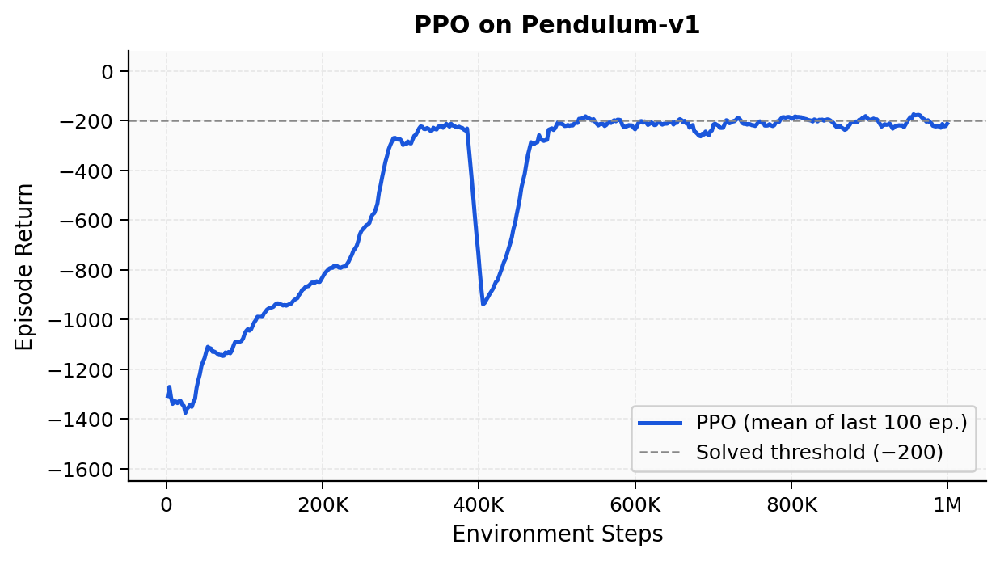
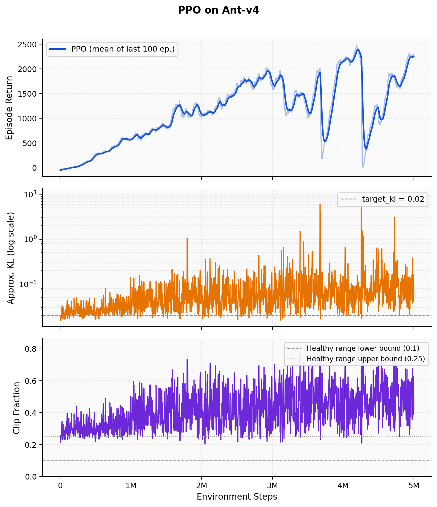

# PPO — Proximal Policy Optimization

Clean PyTorch implementation of PPO with GAE, trained on MuJoCo continuous-control tasks.

## Results

### Pendulum-v1
Converges to ~−200 (solved threshold) within 1 M environment steps.



### Ant-v4
Reaches ~2 200–2 500 cumulative reward over 5 M steps. The middle panel (KL divergence)
shows the `target_kl = 0.02` guard keeping most updates within safe range; occasional
spikes recover within a few updates.



### PPO vs TD3 — Sample Efficiency


**What is plotted.**
Both curves show the *episodic return* averaged over environment steps on a shared
x-axis, making the comparison independent of wall-clock time or episode count.

- **PPO** (blue): running mean of the last 100 completed episodes, logged every
  rollout (2 048 steps). Already smooth by construction.
- **TD3** (red): per-episode raw reward smoothed with a trailing rolling mean
  (window = 40 episodes for Pendulum, 30 for Ant). The shaded band is ±1 standard
  deviation over the same window, reflecting the variability of the raw returns.

On Pendulum-v1 TD3 reaches the converged level (~−170) in **300 K steps** versus
~600 K for PPO — roughly 2× more sample-efficient. On Ant-v4 the gap is larger:
TD3 achieves ~2 270 in **1 M steps** while PPO needs **5 M steps** for comparable
performance, consistent with the expected off-policy advantage on higher-dimensional
continuous-control tasks.

---

## Code structure

```
ppo/
  config.py          # CLI argument parsing, PPOConfig dataclass
  networks.py        # build_mlp + ActorCritic (discrete & continuous)
  ppo_agent.py       # PPOAgent: act / bootstrap_value / update
  rollout_buffer.py  # fixed-size on-policy buffer, GAE, minibatch iterator
  train.py           # training loop
  logger.py          # TensorBoard wrapper
  ptu.py             # device helpers
  plot_results.py    # regenerate result plots from saved TensorBoard events
  results/           # pre-generated training-curve PNGs
```

## Running

```bash
# Install dependencies
pip install -r ppo/requirements.txt

# CartPole (quick sanity check, ~1 min)
python -m ppo.train --env_name CartPole-v1 --total_timesteps 50000

# Pendulum-v1
python -m ppo.train \
  --env_name Pendulum-v1 --exp_name ppo_pendulum \
  --total_timesteps 1000000 --n_steps 2048 \
  --entropy_coef 0.0 --target_kl 0.02

# Ant-v4
python -m ppo.train \
  --env_name Ant-v4 --exp_name ppo_ant \
  --total_timesteps 5000000 --n_steps 2048 \
  --size 256 --entropy_coef 0.0 --target_kl 0.02

# Regenerate result plots
python ppo/plot_results.py
```

## Key hyperparameters

| Parameter | Pendulum | Ant-v4 |
|-----------|----------|--------|
| `n_steps` | 2 048 | 2 048 |
| `update_epochs` | 10 | 10 |
| `minibatch_size` | 64 | 64 |
| `lr` | 3e-4 | 3e-4 |
| `gamma` | 0.99 | 0.99 |
| `gae_lambda` | 0.95 | 0.95 |
| `clip_eps` | 0.2 | 0.2 |
| `target_kl` | 0.02 | 0.02 |
| `entropy_coef` | 0.0 | 0.0 |
| `hidden size` | 64 | 256 |
